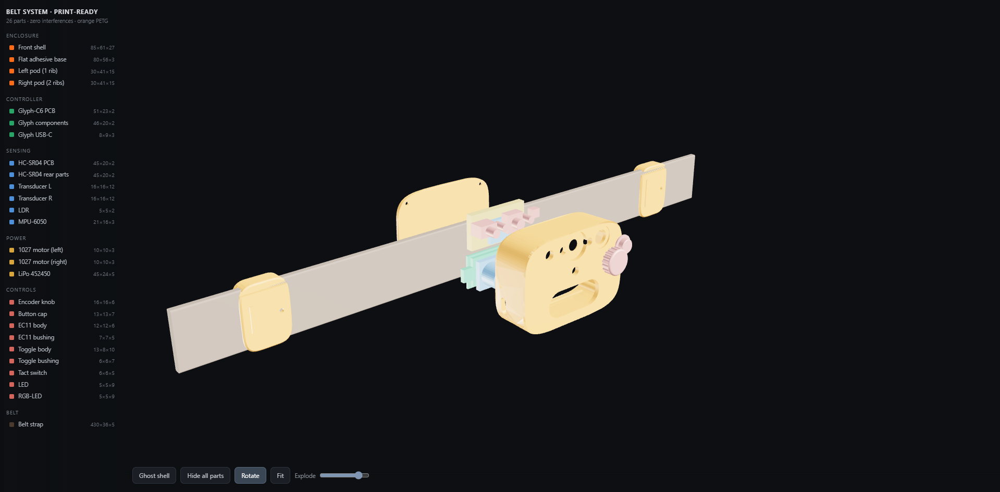
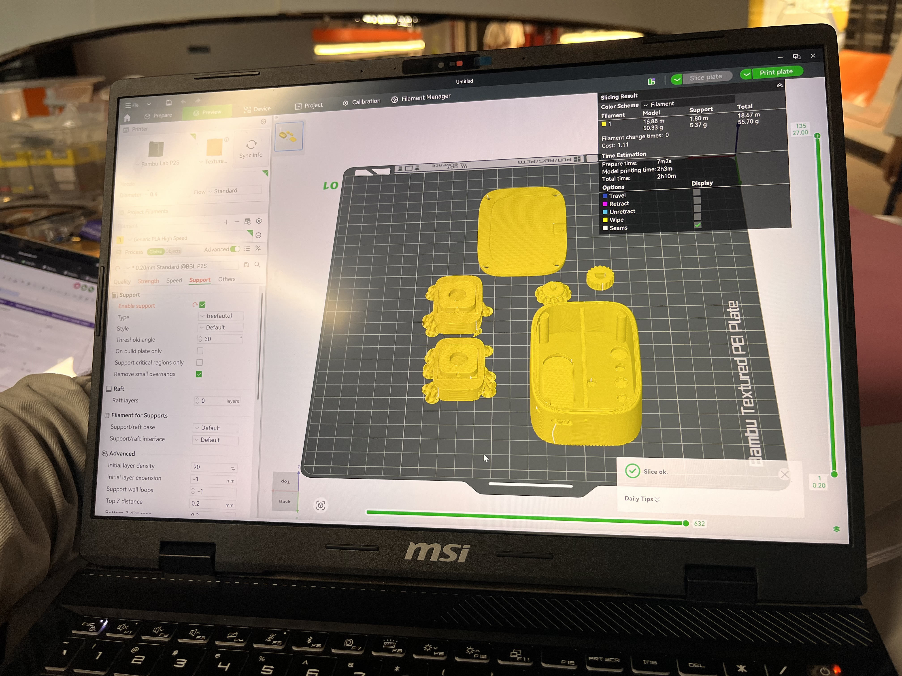

# NETRA mechanical and 3D-printing files

This directory contains the printable enclosure parts for the NETRA V1 wearable sensor device. The source STL filenames are preserved so they can be traced back to the original mechanical export.

## Interactive assembled-system viewer

Open [`belt_system_viewer.html`](belt_system_viewer.html) in a modern browser to inspect the complete belt system, enclosure, controller, sensors, controls, power components, and wearable pods in an interactive 3D scene.

The viewer provides:

- orbit, pan, zoom, automatic rotation, and fit-to-view controls;
- a ghosted enclosure mode for inspecting internal placement;
- per-part visibility controls and component dimensions;
- an explode slider for separating the assembly;
- embedded model geometry, with only the Three.js runtime loaded externally.

An internet connection is required when opening the viewer because it loads Three.js from cdnjs.



## Printer and slicer used

The photographed NETRA enclosure print job was prepared in **Bambu Studio** for a **Bambu Lab P2S 3D printer**. The slicer preview used a 0.20 mm layer profile with automatic tree supports; the pictured plate estimated approximately 55.7 g of filament and 2 hours 10 minutes total print time. Treat these values as a record of this prototype build—re-slice the STL files for your own printer, nozzle, filament, and calibration.



## Included parts

| File | Intended part |
|---|---|
| [`pod_1027_left.stl`](stl/pod_1027_left.stl) | Left wearable pod component |
| [`pod_1027_right.stl`](stl/pod_1027_right.stl) | Right wearable pod component |
| [`v2_button_cap.stl`](stl/v2_button_cap.stl) | External button cap |
| [`v3_knob.stl`](stl/v3_knob.stl) | User-control knob |
| [`v7_base.stl`](stl/v7_base.stl) | Main enclosure base |
| [`v7_shell.stl`](stl/v7_shell.stl) | Main enclosure shell/top cover |

## Prepare the files

1. Download this repository or the individual STL files.
2. Import the required models from `mechanical/stl/` into Cura, PrusaSlicer, OrcaSlicer, Bambu Studio, or another STL-compatible slicer.
3. Treat the models as millimetres. Confirm the displayed dimensions before slicing; do not rescale unless your slicer imported them in another unit.
4. Place the largest flat surface on the build plate where practical.
5. Inspect the HC-SR04 openings, button/knob features, overhangs, and internal mounting points in the layer preview. Enable supports only where the selected orientation needs them.

## Suggested starting profile

These values are a safe prototype starting point, not a substitute for tuning your printer and material:

| Setting | Starting value |
|---|---|
| Material | PLA for prototypes; PETG for improved impact/heat resistance |
| Layer height | 0.20 mm |
| Walls/perimeters | 3 |
| Top and bottom layers | 4–5 |
| Infill | 20–30% |
| Supports | Build plate only, where required by preview |
| Brim | Optional for pod parts or a small bed-contact area |

## Assembly workflow

1. Print one `v7_base`, one `v7_shell`, the button cap, the knob, and the pod parts needed by your wearable configuration.
2. Remove supports and carefully deburr sensor, control, cable, and fastener openings.
3. Dry-fit the HC-SR04, controller, controls, and enclosure halves before installing fasteners or adhesive.
4. Check that the button cap and knob move freely without holding the internal switches permanently active.
5. Route wiring away from enclosure edges and moving controls. Keep the HC-SR04 transducers unobstructed.
6. Confirm the HC-SR04 echo voltage divider and common grounds before powering the assembled device.

> [!CAUTION]
> Printer tolerances and component dimensions vary. Do not force electronics into a tight print. Adjust slicer compensation or lightly finish the relevant opening, then dry-fit again.

## Directory layout

```text
mechanical/
├── README.md
├── belt_system_viewer.html
└── stl/
    ├── pod_1027_left.stl
    ├── pod_1027_right.stl
    ├── v2_button_cap.stl
    ├── v3_knob.stl
    ├── v7_base.stl
    └── v7_shell.stl
```
